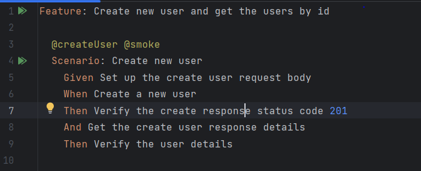
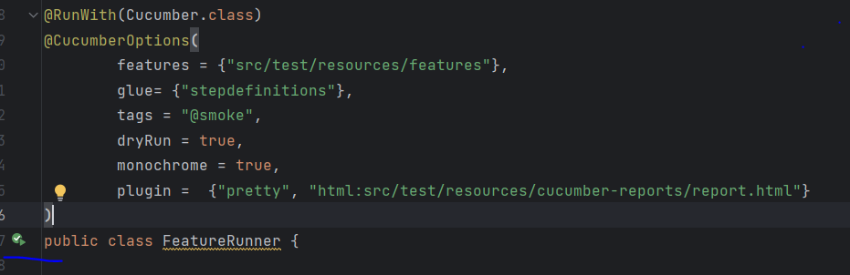

# Users API automation project


# Description
This project runs the basic test of users api.

## How do I get set up?

* Install JAVA JDK 11
* Install [IntelliJ IDEA Community Edition](https://www.jetbrains.com/idea/download)
* Install cucumber java and gherkin plugin for IntelliJ
* Add latest version of necessary cucumber dependencies to the pom.xml file
  * cucumber-core
  * cucumber-junit
  * cucumber-java
  * cucumber-jvm-deps
  * gherkin
  * cucumber-html
  * junit
* Install maven in local machine (Recommended to use the latest version)

### Authorization
No authorization required to access APIs in this project.

## Architecture
The application packages are organized by application that is being tested, e.g.:

```diagram
📦 main
  📦 apiservice
      ┣ 📂 handler
      ┣ 📂 requestfactory
      ┣ 📂 requestmodel
      ┣ 📂 responsemodel

  📦 common
      ┣ 📂 base
      ┣ 📂 configuration
      ┣ 📂 restcommon
      ┣ 📂 utility

  📦 resources
      ┣ 📂 log.xml

📦 test
  📦 java
      ┣ 📂 stepdefinitions

  📦 resources
      ┣ 📂 cucumber-reports
      ┣ 📂 data
      ┣ 📂 features
 
```
### Run the scenarios

### Using feature file
Click the run icon on left side scenarios.



Using runner class can run the scenarios




### Using Maven
mvn install  (This command will install dependencies and run the test)

### Reports
If we run the scenarios from runner class, we can find the test report on cucumber-reports folder under the resources' folder which placed test sub folder.
Path = (test -> resources -> cucumber-reports -> report.html)

### Common Classes
UsersUtils - This class used to get random values.
RestRequests - This class has common methods to send the request.
ExtentReportConfig - This class has common methods for extent reports.
ObjectRepositoryReader - This class has common method to get value from repository file.
BaseHelper - This class has method which executes before the suite, after the suite, and before the test.
UserHandler - This class has common method for all type of request methods.
UserFactory - This class has common methods to set up the values in request body.

